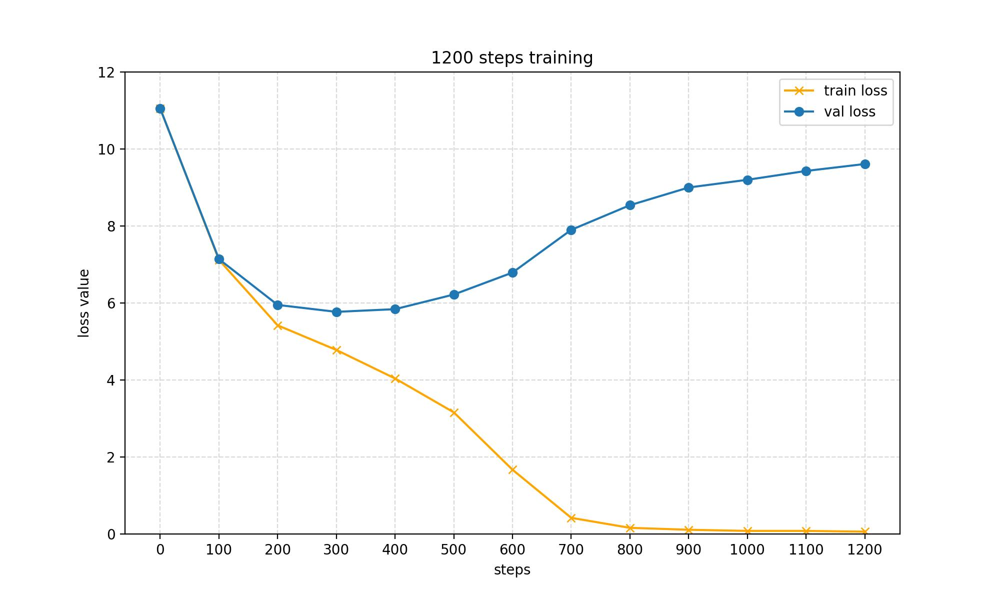

# NanoLlama - Personal Project


NanoLlama is a minimalistic implementation of the Llama model, designed with only 200 million parameters. This makes it incredibly lightweight and easy to use, hence the name "NanoLlama."

## Description

NanoLlama is a simplified version of the Llama model, optimized for environments with limited computational resources. With only 200 million parameters, it offers a great balance between performance and efficiency.

- `Number of Parameters`: 216 M
- `Inference Loading`: 872.7 MiB

## Requirements

To get started, ensure you have the following Python packages installed:

- `transformers`
- `torch`

## Getting Started

Follow these steps to set up and train NanoLlama:

1. **Data Preparation**
   Navigate to the `/data/shakespeare directory`  and run the following command to preprocess the data:

   ```bash
   python parpare.py
   ```

2. **Training Configuration**
   Open the `train.py` file and modify the `device` variable to select your desired training environment:

   ```python
   device = 'cpu' or 'cuda'
   ```

3. **Training the Model**
   After configuring the training device, start the training process with:

   ```bash
   python train.py
   ```

4. **Inference**
   After training, `/out-shakespare` is obtained. We can load the weight to inference. Just simply run:

   ```python
   python inference.py
   ```

5. **Experimental Results**
   I trained a model with 1300 steps, and logged the training and val loss per 100 steps.


