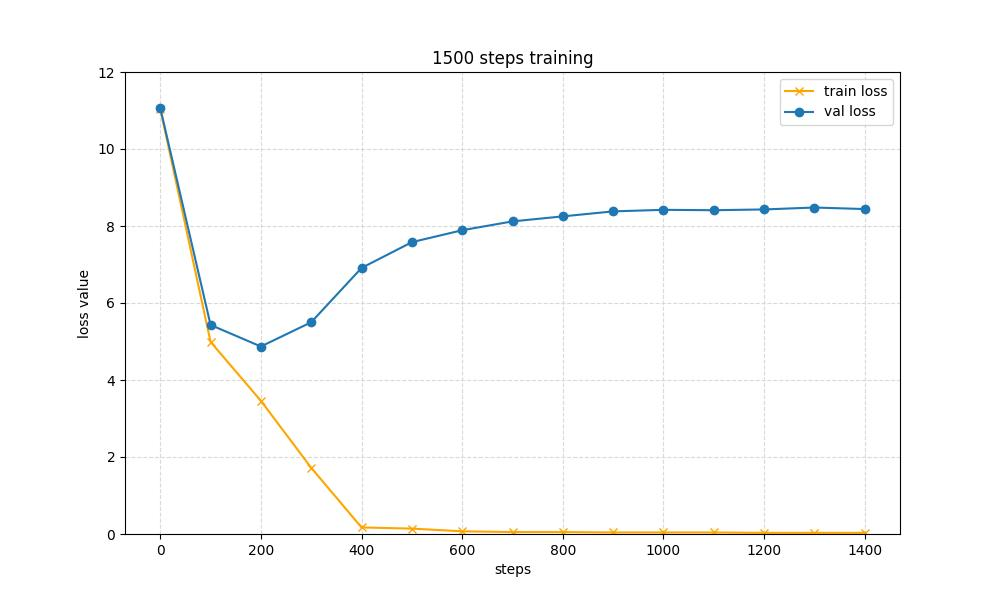

# NanoLlama


This project was developed by `66Tracy`with reference to [karpathy/nanoGPT](https://github.com/karpathy/nanoGPT). NanoLlama is a minimalistic implementation of the Llama model, designed with only 200 million parameters. This makes it incredibly lightweight and easy to use, hence the name "NanoLlama".

## Description

NanoLlama is a simplified version of the Llama model, optimized for environments with limited computational resources. With only 200 million parameters, it offers a great balance between performance and efficiency. And I trained the model from scratch using the `Tiny Shakespeare` dataset, which consists of dialogues from various characters.

- `Number of Parameters`: 216 M
- `Inference Loading`: 872.7 MiB
- `Training Dataset Tokens`: 301,966 tokens

## Requirements

To get started, ensure you have the following Python packages installed:

- `transformers`
- `torch`

## Getting Started

Follow these steps to set up and train NanoLlama:

1. **Data Preparation**
   Navigate to the `/data/shakespeare directory`  and run the following command to preprocess the data:

   ```bash
   python parpare.py
   ```

2. **Training Configuration**
   Open the `train.py` file and modify the `device` variable to select your desired training environment:

   ```python
   device = 'cpu' or 'cuda'
   ```

3. **Training the Model**
   After configuring the training device, start the training process with:

   ```bash
   python train.py
   ```

4. **Inference**
   After training, `/out-shakespare` is obtained. We can load the weight to inference. Just simply run:

   ```python
   python inference.py
   ```

5. **Experimental Results**
   I trained a model with 1500 steps, and logged the training and val loss per 100 steps.

<p align="center">
  
</p>

   And the inference performance is as below: (with `GRUMIO:` as prompt, we can see some interesting output)

   ```text
   GRUMIO:
   ----------------------- begin generation -----------------------
   An you can pardon of a lady me,
   And the prince.
   
   LUCIO:
   Nay, an eagle, then,
   Will you go with a prisoner to the prince's goodly
   Of the time to the belly?
   
   DUKE VINCENTIO:
   To go:
   By much, you play'd in a foot to the other's not the
   To the eyes
   Will you as good my good, back of his
   the crows my first that with us;
   And his badIO: not the morning of good
   And in the house of mine own of his jot.
   
   MARIANA:
   A Patricians,
   I mean of the great good
   very summer, so brief, which they see how they from his life.
   
   DUKE VINCENTIO:
   He should deliver'd: if he is't.
   
   DUKE VINCENTIO:
   I'll call him that I, he Angelo;
   And so much of his life, to you must be
   A word: but, the world, he;
   Or a guest he made; for them here?
   ```
